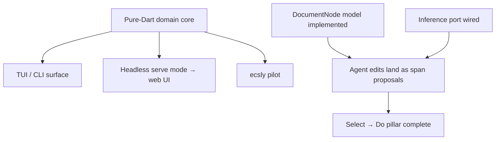

# ADR 0002 — Core Extraction & ecsly Migration Plan

- Status: Accepted
- Date: 2026-08-24
- Builds on: [ADR 0001 — Recursive Document Node Model](0001-recursive-document-node-model.md),
  multi-surface thread (`docs/archive_threads/tui.md`), storage backends plan (steps 1–4, done)

## Context

The product goal is "the document is the product" on **many surfaces** — Flutter app today;
TUI / CLI+web later. That requires the domain core to be pure Dart with no Flutter
dependency. Today it is not:

- `packages/core` mixes pure models (`project.dart`, freezed) with Flutter-heavy code
  (`google_fonts`, `go_router`, `file_picker`, widgets inside `services/auth`).
- `DocInferencePort` exists but is unimplemented and disconnected from the new
  `xsoulspace_inference_*` / `xsoulspace_inference_acp` packages.
- The `DocumentNode` model of ADR 0001 is designed but not implemented.
- ecsly is proven in other apps in this ecosystem; Last Answer has not adopted it.

Steps 1–4 of the agent-integration plan are done: ACP client, inference-backed agents,
outbox-staged agent edits, Android filesystem defaults.

## Analysis: what blocks what



Key arguments:

1. **Core extraction precedes everything else.** TUI, web, and ecsly all need a
   Flutter-free core. Extracting first is valuable even if ecsly adoption stalls —
   it is a prerequisite either way, so it carries no speculative risk.
2. **Implement ADR 0001's model in the extracted core, not in `packages/core`.**
   Building `DocumentNode` inside Flutter-coupled `packages/core` would create a second
   migration later. Build it once, in the right place.
3. **ecsly pilot targets the block/span graph only** — not state management, not routing.
   `ecsly_app`/`ecsly_flutter` adoption is a separate, later decision. Keeping the pilot
   narrow keeps it reversible.
4. **The inference port should be an adapter over `InferenceClient`**, not a parallel
   abstraction. `AcpInferenceClient` already proves the shape; `DocInferencePort`
   becomes a thin app-level facade over `xsoulspace_inference_core`.

## Decision

### Package layout

```
pkgs (new workspace or last_answer/packages/):
  last_answer_domain      # DocumentNode, Block, AnchorSpan, ids, templates (pure Dart)
  last_answer_storage     # repository interfaces + universal_storage adapters
  last_answer_agents      # staging/promotion flow over AgentEditStager + InferenceClient

last_answer/packages/core:  # stays; slims down over time
  Flutter-specific services, theming, l10n, auth UI
```

Domain package depends on nothing but `freezed_annotation`, `from_json_to_json`,
`meta`. Storage package depends on `universal_storage_interface`. Agents package depends
on `xsoulspace_inference_core` (+ optional `xsoulspace_inference_acp`).

### Sequencing

| Phase | Deliverable                                                                                | Done when                                                    |
| ----- | ------------------------------------------------------------------------------------------ | ------------------------------------------------------------ |
| P1    | `last_answer_domain`: implement ADR 0001 model (`DocumentNode`, blocks, anchors, collapse) | Round-trip JSON tests; no Flutter imports                    |
| P2    | `last_answer_storage`: filesystem-backed node repository (one file per node per ADR 0001)  | Conformance test vs in-memory repo; nesting works            |
| P3    | Wire into app behind existing repositories; migrate `ProjectModelDoc` data                 | App reads/writes docs through new stack; old data migrates   |
| P4    | `last_answer_agents`: proposal flow = stage → review UI → promote, using `AgentEditStager` | Agent edit appears as reviewable proposal, promotes into doc |
| P5    | Replace `DocInferencePort` with adapter over `InferenceClient`; wire Select→Do actions     | Ask AI / Expand / Summarise work through pluggable backends  |
| P6    | ecsly pilot: block/span/thread graph as entities+components in a benchmark/test harness    | Ergonomics report written; go/no-go decision recorded        |
| P7    | If go: adopt ecsly in domain internals; if no-go: keep freezed models                      | Decision documented as ADR addendum                          |

### Explicit non-goals for this plan

- No TUI/web implementation here — they become possible after P2 but are separate plans.
- No `ecsly_app`/`ecsly_flutter` adoption decision inside this plan.
- No SAF/user-picked-folder support (deferred from step 4).
- No multiplayer/presence work.

## Consequences

Positive:

- Multi-surface becomes a build-target question, not an architecture question.
- ADR 0001 finally gets its implementation home.
- Agent integration (steps 1–4) plugs into real seams instead of waiting.
- ecsly decision is made on measured evidence inside this codebase.

Costs / risks:

- P3 migration touches live user data — needs export path + backup-first rollout via
  the existing replication system.
- Two model systems coexist during P3–P5 (old `ProjectModelDoc`, new `DocumentNode`);
  timebox the overlap and migrate feature-by-feature (doc feature first).
- ecsly is still pre-1.0; P6 must be timeboxed (e.g. ≤1 week) to avoid R&D sprawl.

## Falsifier / review triggers

Revisit this plan if:

- P2 reveals filesystem-per-node is too slow on Android for typical doc counts — then
  reconsider single-file embedding for mobile.
- P6 shows ecsly ergonomics cost more than freezed for this graph — record no-go and
  keep the domain package freezed-based (the extraction itself remains justified).
- Product pivots away from doc-centric editing — phases P4–P7 lose priority.
